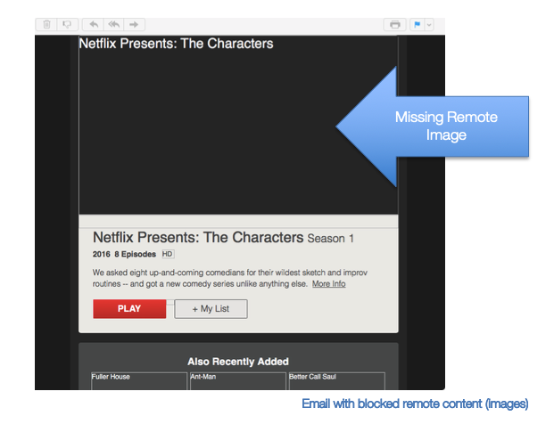
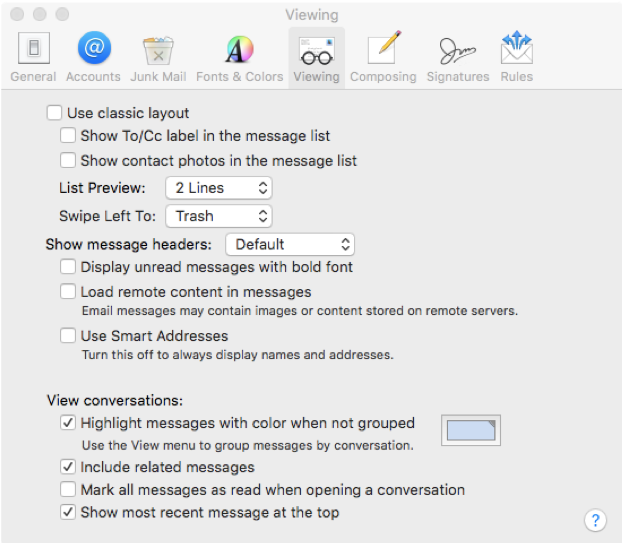
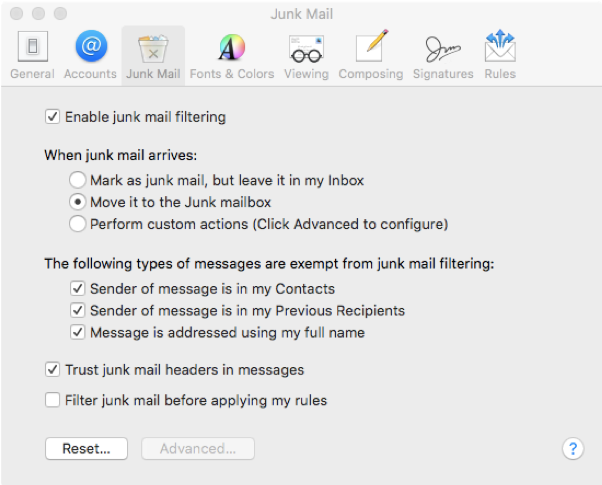
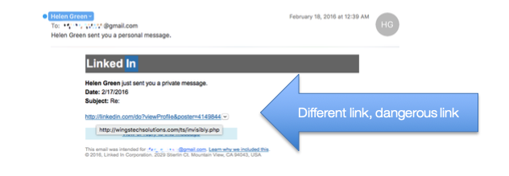

# Behaving Yourself

This document is a reference and preparation sheet for the trainer, and a companion to the lesson plan.

The Learning Objectives summarize the knowledge that learners should have gained by the time they reach the end of the module.

The Background and Detail for Trainer provides greater details on the content, and links to references. It will allow trainers to learn more about the topic so they can lead discussions or answer questions confidently without being limited to the classroom content. Each item in the Background supports a section in the Lesson Script.

### Learning objectives

- An	understanding	 of 	how 	disclosure	affects	your	privacy	and	the	privacy	of 	others

- An	understanding	of	the	risks	associated	with	social	networks	and	how	public	sharing	on		these	networks	can	 be 	detrimental	to	others

- An	understanding	 of	the	risks	associated	with	intimacy	online

- Ability	to	configure	privacy	settings	on	Facebook

## Background and Detail for Trainer

### 1 Sharing with the world

#### 1.1 In Brief

We	can	express	ourselves	freely	online.	However,	we	should	be	considerate	when	sharing	in public	and	semi-private.

#### 1.2 In Detail

- Public publishing

	- The	Internet	allows	people	to	share	their	lives,	knowledge	and	opinions	online.

		- It	is	perhaps	the	ultimate	tool for 	free	speech,	allowing	anyone	to	express themselves	online.

			- With	such	great	power	also	comes	a	greater	responsibility	to	participate	in global	society	in	a	reasonable	way.

		- We	might	be	tempted	to	vent	our	frustrations	or	be	less	constructive	in	our communication	than	we	should.

			- The	emotional	release	of	this	expression	generally	turns	to	regret,	as	the outburst	is	permanent.

			- It	pays	to	read	your	comment	aloud	before	pressing	‘Send’	to	see	 if	 it	 sounds polite	and	constructive.

			- Remember	that	what	you	send	could	remain	online	forever,	and	may	 be seen by 	friends,	family	and	future	employers	as	representing	your	attitudes.

		- Even	if	you	feel	your	comments	are	anonymous,	in	practice	this	is	difficult	to achieve	as	ultimately,	online	service	providers	could	be	forced	by	a	court	to	reveal your	identity.

	- Abuse online	can	be	directed	at	the	author	of 	an	article,	be	a	personal	attack,	be	dismissive of 	another	person,	or	even	contain	the	threat	of	harm.

	- This	abuse	could	be	considered	as	constituting	harassment	online	or	result	in	a	criminal	or civil	proceeding	for	reasons	of	defamation,	libel	or 	privacy	invasion.

	- In	Canada,	statements	that	incite	or	wilfully	promote	hatred	against	any	identifiable	group, where	such	incitement	is	likely	to	lead	to	a	breach	of	the	peace,	are	considered	to	be	a crime	under	laws	relating	to	hate	speech[Note 1](#note-1).

	- The	Internet	does	not	limit	what	you	can	share,	who	you	share	with	or	when.

		- You	can	openly	and	freely	share	your	life and	opinions	but	be	aware	that	you	have no	control	over	the	in	context	they	will	be	read	in.

			- Providing	very	personal	details	or	even	exhaustive	updates	on	the	details of 	your	daily	routine	could	cause	discomfort	or	wear	on	relationships	with friends	and	family.

		- Be	aware	of	what	you	are	sharing.	It	may	reveal	more	than	you	intend	or	be revealed	to	more	people	than	you	intend.

			- Geographic	tags	in	posts	and cues	in	images	and	posts	could	provide information	about	your	routine,	where	you	live,	work	or	go	to	school.

				- Your	posting	might	tell 	burglars	and	other	criminals	what	is	 in	 your	home and	when	you	are	away.

	- Everyone	has	different	ideas	about	privacy.	Even	people	in	the	same	family	can	have different	ideas	about	what	is	private.

		- Be	aware	of	this,	particularly	when	sharing	details	that	may	have	occurred	in	a private	space,	photographs	of	other	people,	children	and	the	private	spaces	of others	(such	as	their	houses).

		- What	you	choose	to	disclose	publicly	or 	semi-publicly	(within	a	group	of	friends	or family)	could	cause	a	problem	if	a	friend	has	chosen	not	to	disclose.

			- For 	example,	partners	finding	out	about	engagement	rings	before	the proposal,	employers	finding	out	about	dishonest	sick	days,	insurers questioning	claims	and	parents	discovering	their	children’s sexual	preferences.

#### 1.3 In Practice

DO	think	carefully	about	others	before	sharing	online.

DO	consider	the	privacy	of 	others.

DO	be	conscious	of	how	much	you	are	sharing.

### 2 Personal relationships online

#### 2.1 In Brief

Internet	technology	provides	new	ways of sharing intimately.	There	are	some	new	risks	with intimacy online	that	you	should	consider	first.

#### 2.2 In Detail

- Information	and	communication	technology	is	everywhere	in	modern	Canadian	society.

	- It	has	become	part	of	relationships.

		- The	tools	of	modern	communications	technologies	have	new	benefits	and	risks	for relationships.

		- Computers	and	the	Internet	have	benefited	couples,	particularly	those	in	long-distance	relationships,	allowing	them	to	build	greater	trust	and	feel	more	satisfied.

	- The	development	of	technologies	that allow	people	to	produce	and	distribute	images	and video	has	led	to	it	being	turned	to	intimate	uses.

		- Each	development	of	personal	communications	technologies	has	been	turned	to this	purpose	in	forms	such	as	love	letters,	Polaroid	photographs,	and	phone	sex.

			- Intimate	uses	of	personal	computing	devices	such	as	smartphones,	tablets, notebooks	and	personal	computers	should	not	be	surprising.

		- The	intimate	use	of	computers	is	commonly	called	“sexting,”	a	combination	of	“sex” and	“texting”	or 	sending	text	via	a	messaging	service.

			- Some	applications	seem	well	suited	to	or	have	become	synonymous	with sexting[Note 2](#note-2).

				- Encrypted	messaging	applications sometimes	offer	features	such	as secure	communications	and	timed	image	destruction.

				- Encryption	software	with	‘end-to-end’	encryption,	meaning	the	message in	encrypted	at	your	device	and	stays	encrypted	until	it	reaches	its destination,	are	considered	more	secure.

				- It	is	hard	to	know	exactly	what	happens	when	these	programs	do	their work,	so	independent	verification	of	their	function	is	better.

				- Some	applications	are	designed	to	encrypt	files	(like	images)	where they	are	stored[Note 3](#note-3).

				- Both	Windows	and	Apple	computer	systems	have	inbuilt	capabilities	to encrypt	files[Note 4](#note-4).

			- No	application	can	guarantee	the	confidentiality	of 	your	communications.

				- Even	in	the	unlikely	event	that	the	software	is	completely	secure,	we	all make	mistakes	sometimes.

				- It	is	always	possible	to	simply	snap	a	picture	of	the	display	with	another camera,	overcoming	any	security	technology.

			- The	application	called	Snapchat	is	often	used	for	sexting.

				- Snapchat	and	other	image	messaging	tools	are	primarily	used	as	a	fun and	easy	way 	to	share	selfies	and	other	images	with	text	and	drawings with	close	friends	and	family.

				- The	presence	of	Snapchat	on	the	device	is	no	indication	that	the	device is	used	for	sexting.

				- Snapchat	is	not	the	most	secure	application	available,	it	is	not recommended	for	use	with	intimate	images.

		- Sexting	is	a	fairly	common	practice,	with	various	studies	suggesting	that	at	least 20%	of	people	engage	in	some	form	of	sexting

			- Consensual	sexting	has	not	been	shown	to	have	any	effect	on	a	person	or their	relationship	or	any	link	to	other	sexual	behaviours	that	are considered	risky.

			- Sexting	is	not	problem	free.

			- There	is	a	clear	difference	between	consensual	and	non-consensual	sexting.

				- Non-consensual	sexting	is	never	ok.

				- It	is	important	to	talk	about	it	first,	preferably	face-to-face.

				- Talking	first	is	important	because even	just	sending	a	sext	if	your	partner does not	feel	comfortable	reciprocating	could have a	negative	impact on	that	person,	on you	and	on	the	relationship.

				- Take	it	slow,	take	care	to	set	out	your	boundaries	and	communicate. This	could	help	to	avoid	conflicts	around	the	differences	in	privacy expectations	and	practices	between	you	and	your	partner.

				- Sexting	is	not	necessary	or 	expected	in	a	relationship,	and	could become	a	source	of	unwarranted	stress	on	the	relationship.

			- There	is	a	clear	difference	between	sending	and	receiving	sexts	with	a consenting	partner,	and	showing,	forwarding	or	distributing	those	messages or	images	to	someone	else.

			- Distributing	intimate	images	is	not	a	safe	practice.	Sending	images	increases the	chances	of	those	images	being	lost	or	winding	up	on	the	Internet.

				- The	more	computers	or	devices	the	images	are	transferred	through	or exist	on,	the	greater	the	chance	of	a	security	issue	with	one	of	those devices	or	that	its	user	makes	a	mistake.

			- Most	people	view	forwarding	personal	intimate	images	as	a	violation	of	their privacy,	so	distributing	an	image	could	be	devastating	to	the	relationship	and to	 your	partner.

			- People	have	been	known	to	deliberately	distribute	intimate	images	without consent,	often	after	a	break-up[Note 5](#note-5).

				- The	people	affected	by	this	have	suffered	harm	beyond	the psychological,	including	losing	their	jobs,	being	forced	to	change	their names,	their	schools	and	have	been	subject	to	offline	stalking and	harassment.

			- Because	of	the	great	harm	of	sending	intimate	images	without	consent,	it is	illegal.

				- Under Canadian law[Note 6](#note-6): "Everyone	who	knowingly	publishes,	distributes, transmits,	sells,	makes	available	or	advertises	an	intimate	image	of	a person	knowing	that	the	person	depicted	in	the	image	did	not	give	their consent	to	that	conduct,	or	being	reckless	as	to	whether	or 	not	that person	gave	their	consent	to	that	conduct,	is	guilty[Note 7](#note-7)" of 	a	crime.

			- Sexting	for	adolescents	and	young	adults	is	potentially	more	complex.

				- Making,	printing,	publishing	or	possessing	any	photographic,	film,	video or	other	visual	representation	of	a	person	who	is	or	is	depicted	as	being under	the	age	of	18	engaged	in	sexual	activity	or 	focuses	on	the	sexual (including	breasts)	or	anal	region	is	illegal[Note 8](#note-8).

					- There	is	an	exception	in	Canada	for	exchanging	sexual	images between	intimate	partners	in	a	legal	sexual	relationship	(i.e.	where their	age	complies	with	the	age	of	consent).

					- It	is	unlikely	that	the	police	will	prosecute	teens	with	a	criminal offence.	The	authorities	have	taken	action	against	the	distribution of 	images	by	someone	outside	that	relationship.

					- If 	you	receive	an	intimate	image	of	someone	sent	without	their consent,	or	if 	someone	distributes	an	intimate	picture	of	you without	your	consent,	neither	you,	the	person	in	the	image	nor	the person	who	made	the	image	is	necessarily	guilty	of 	a	crime.	It	is possible	to	seek	the	support	of	parents,	teachers	and	even the	police[Note 9](#note-9).

#### 2.3 In Practice

DO	get	your	partner’s	consent	before	sexting.

DO	seek	independently-verified	encryption software for your communications,	and	know	there are	still risks.

DO	keep	intimate	images	private.	Forwarding to others is not acceptable.

DO	seek	counsel	if 	you	receive	images of others without their	consent.

### 3 Social networks

#### 3.1 In Brief

Social	networks	allow	us	to	share	in	a public or semi-private way.	They	are	an	easy	way 	to	stay in touch but socializing	online	does	present	new	risks.

#### 3.2 In Detail

- Social	media	or	social	network	services	are	Internet	services	that	allow	people	to	create	a public	or	semi-public	profile,	and	find	and	connect	with	other	users	to	share	content.

	- They	are	an	easy	way 	to	stay	in	touch	with	friends,	family	and	acquaintances.

	- Like	any	other	form	of	communication	online	they	can	also	contain	some	risks.

		- Just	like	email	and	other	webpages,	social	media	present	a	potential	source	of malware,	phishing	and	other	scams.

			- Think	carefully	before	clicking	on	content	on	these	pages.

				- Malware	can	be	spread	by	disguising	itself	as	articles	with	catchy	titles such	as	“Get	rid	of	dental	plaque	in	5	minutes”	or 	“HD	Show,	Watch!”

				- These	can	lead	to	other	pages,	which	install	malware	and	can	spread to	 your	social	media	contacts,	such	as	by	disguising	a	“share”	or 	‘like’ button	as	an	“X”.

Image : 

Figure 1 : [Analyzing a Facebook Clickbait Worm](https://blog.sucuri.net/2015/06/analyzing-a-facebook-clickbait-worm.html)

- Social	networks	also	present	more	subtle	harms	as	they	can:
	- Be	a	source	of	irritation	because	of	inappropriate	or	annoying	content,	like spam	email;
	- Become	a	time-consuming	social	obligation;
	- Lead	to	feelings	of	lacking	control	over	privacy	where	the	privacy	settings	are not	able	to	match	expectations;
	- Be	a	source	of	issues	due	to	social	comparisons	and	jealousy;
	- Be	a	source	of	conflict.

- A	potential	source	of	conflict	can	be	with	the	public	announcement	of	relationship status	on	social	media.
	- For 	example,	Facebook	allows	people	to	state	that	they	are	“in	a	relationship with”	another	member	of 	Facebook,	and	will	link	their	profiles.

		- Publicizing	this	relationship	status	is	called	going	“Facebook	Official” or "FBO".

		- Going	FBO	is	a	very	public	broadcasting	of	the	relationship	to	large social	groups,	and	thus	could	be	considered	a	greater	step	than	more traditional	stages	of	commitment	in	relationships.

		- However,	the	actual	commitment	implied	by	this	status	may	be	different between	people	and	genders,	which	could cause	conflict.

		- If 	the	relationship	changes,	it	could	also	be	a	source	of	stress	as	this	is also	announced	to	a	large	group	of	friends.

- Our	use	of	social	media	can	affect	the	way 	we	discuss	issues	both	on	and	offline	in	an	effort to	manage	our	appearance	in	a	larger,	more	varied	and	ubiquitous	social	group.

	- This	can	lead	to	self-censoring	in	order	to	fit	in	with	the	group,	or	not	analyzing issues	as	one	would	have	without	this	pressure,	and	potentially	inhibiting critical	thinking.

#### 3.3 In Practice

DO	think	before	you	click	on	social	media posts.

DO	be	aware	that	social	media	can	be	cause of conflict.

### 4 Setting privacy on social networks

#### 4.1 In Brief

Facebook	provides	controls	over	the	privacy of  your profile and interactions.	The	exact	function of 	these controls is difficult to understand. Managing these settings	can	be time-consuming—but it is important.

#### 4.2 In Detail

- Information	on	your	Facebook	account

	- Every	time	you	add	content	to	your	account,	whether	it	is	a	status,	photo,	video,	profile	or cover	picture,	job,	relationship	or	interest	update,	this	content	may	be	 visible	as	a	“Timeline Post”	that	shows	up	in	others’	news	feeds	and	as	information	on	your	profile.

		- A	“post”	is	content	on	your	Timeline	that	others	may	interact	with	through	their news	feeds.	They	can	“like,”	“comment”	or 	“share”	your	posts.	Posts	include	status updates,	pictures	and	life	events.

		- Other	information,	such	as	a	job,	relationships	status,	places	you’ve	been	or interests	are	forms	of	passive	content	visible	on	your	profile.	However,	when	new events	are	added,	such	as	a	new	job	or	relationship,	you	may	choose	to	make	a post	that	others	may	interact	with.

- Changing	the	visibility	of 	your	posts	and	photos

	- Locate	the	icon	beside	the	date	of	publication	of	the	post.	It	will	be	a	globe,	two	silhouettes, a	lock	or	a	gear.	Click	on	this	icon	to	change	the	audience	who	can	see	the	post.

		- Globe	=	Public 

			- Everyone	on	Facebook	and	anyone	who	searches	for	you	on	Google	(unless searching	is	turned	off).

		- Two	Silhouettes	=	Friends 

			- Only	those	in	your	friends’	list,	and	all	of 	their	friends	if	you	tagged	someone. You	may	sometimes	see	three	silhouettes,	which	signifies	“friends	of friends”	or 	one	full	silhouette	with	a	faint	one	behind	it	for	“friends	except acquaintances.”

		- Lock	 =	Only	Me 

			- Only	you	can	see	the	content.

		- Gear = Custom 

			- Certain	custom	groups	(groups	made	on	Facebook	to	include	certain	people such	as	family,	school	or 	work	groups)	may	see	your	post.	Also,	individual people	on	Facebook	can	be	set	to	not	see	the	post,	even	if	they	are	in	your friends	list.

			- Image : 

	- Although	the	profile	picture	posts	give	you	the	option	to	change	the	audience,	this is	exclusively	for 	the	“post”	itself,	not	for	the	visibility	of 	the	profile	picture.

		- If 	you	want	to	change	the	visibility	of 	a	profile	picture,	you	must	go	to	the actual	photo.

		- Image : 

- Keep	in	mind	that	your	current	profile	picture	and	cover	photos	are	public.

	- If 	the	current	profile	picture’s	audience	is	set	to	“Friends”	or 	“Only	Me,”	the	public can	only	see	a	thumbnail	of 	the	image;	however,	it	is	still	visible	if	searched through	Facebook	or	Google	(unless	searching	is	turned	off;	more	below).

	- Once	there	are	multiple	profile	pictures,	however,	these	can	be	set	to	different audiences.	Again,	the	first	and	current	profile picture	may	be	seen	by	anyone	as	a thumbnail,	no	matter	the	privacy	setting.	Cover	photos	and	their	posts	are	always public.

	- Image : 

- To	rapidly	choose	those	who	should	see	posts,	go	to	the	“privacy	shortcut”	icon	in	the	top right-hand	corner	of 	their	profile.

- Image : 

	- There	are	three	options:

		- Who	can	see	my	stuff?

		- Who	can	contact	me?

		- How	do	I	stop	someone	from	bothering	me?

		- Image : 

	- Click	on	the	“who	can	see	my	stuff”	option	to	reveal	options	to	better	control	the visibility	of 	your	posts.

	- Image : 

- Remember	that	your	online	privacy	is	determined	by	the	privacy	settings	of	your	profile,	and by 	how	you	interact	with	other	profiles.

	- If 	a	page	or	a	profile	makes	posts	that	are	public,	then	your	interactions	with	these posts	are	visible	to	everyone	on	Facebook	and	anyone	who	may	search	for you	online.

- Changing	the	visibility	of 	posts	in	which	you	are	tagged

	- Tagging	occurs	when	a	Facebook	friend	identifies	you	in	a	status,	photo	or	event.

		- When	you	are	tagged,	the	content	you	are	tagged	in	is	available	to	the	friends	of the	friend	who	tagged	you,	and	all	your	friends	as	well.

		- Tagged	names	appear	in	blue	as	a	hyperlink	that	redirects	to	your	account.

		- If 	someone	tags	you	in	a	post	that	you	do	not	want	to	be	tagged	in,	you	may remove	the	tag.

		- Image : 

		- Facebook	then	warns	you	that,	although	the	tag	has	been	removed,	it	will	still appear	in	other’s	news	feeds	or	in	searches.

			- You	may	remove	the	tag,	but	not	your	name,	from	the	content.

			- You	also	have	the	option	to	report	the	content	in	which	you	were	tagged.

			- Image : 

			- Image :   

		- You	can	see	that	the	name	remains	in	the	post;	however,	it	no	longer	redirects	to your	profile.	All	the	friends	of	the	person	who	made	the	originally	post	can	still see	it.

		- If 	you	truly	want	the	content	to	be	removed,	Facebook	suggests	that	you	ask	the person	who	made	the	post	to	take	it	down[Note 10](#note-10).

- Changing	the	visibility	of 	information	on	your	profile

	- The	privacy	icons	(globe,	silhouettes,	lock,	gear)	can	be	found	and	customized	for	almost everything	shared	on	Facebook;	employment,	relationship	status,	liked	pages,	contact info,	etc.

		- Therefore,	you	can	choose	the	audience	for	virtually	everything	you	share	on Facebook	by	toggling	these	icons.

			- For 	example,	when	sharing	employment	information,	you	may	set	whom	they want	their	job	to	be	visible	to.

			- Image : 

			- Once	the	information	has	been	saved,	Facebook	asks	whether	you	would	like to	share	it	as	a	post.	When	the	post	is	created,	you	may	change	the	audience as	 you	would	with	any	other	post.

			- Image : 

			- **Caution:** 	certain	external	sources,	such	as	Facebook	comment	sections	on popular	websites	like	Buzzfeed	and	Huffington	Post,	and	applications	like Tinder,	will	publicly	display	your	employment	and	vocational	information, even	if	it	is	not	public	on	your	account.

			- When	your	visible	privacy	settings are	in	place,	a	handy	tool	to	review	your privacy	is	the	“view	as” 	function.

				- This	allows	you	to	view	your	profile	as	any	preferred	audience:	as	your friends	in	general,	as	a	specific	group,	a	specific	profile,	the	public	or only	to	 you.

				- Image : 

				- Imagfe : 

				- This	way,	you	can	go	over	items	that	you	want	the	public,	your	friends, certain	friends	and	groups	to	see.

- Who	can	look	me	up	and	contact	me?

	- By 	default,	Facebook	allows	many	ways	for	your	profile	to	be	discovered.

		- Your	profile	can	be	found	through	your	email	address,	phone	number	or 	through search	engines	such	as	Google	or	Bing.

			- These	options	may	be	found	in	the	“see	more	settings”	link	in	the	“privacy shortcut”	icon	shown	above.

			- Image : 

		- You	can	change	who	can	contact	you	in	these	settings.	If	you	do	not	want	people to	find	you	through	your	email	or 	phone	number,	deactivate	these	settings	here.

		- If 	you	want	to	limit	the	visibility	of 	your	profile	on	the	web,	these	options	may	be disabled.

		- However,	keep	in	mind	that	interactions	with	public	profiles	or	pages	are	visible anywhere,	even	on	Google.

			- If 	you	like	a	public	page,	this	activity	will	be	available	on	Google,	even	if	you have	turned	searching	off	and	changed	the	privacy	of 	your	liked	pages.

			- Image : 

				- For 	example,	a	search	for	Sionn	Fortemain,	a	profile	for	which	searching
is	turned	off,	still	reveals	one	liked page	(even	though	liked	pages	are not	publicly	visible	on	this	account).

#### 4.3 In Practice

DO	take	the	time	to	manage	your	privacy settings on Facebook.

## Glossary of Terms

|Terms|Definitions|
|:------------:|:------------------------|
|Defamation|Communication that lowers the estimation of a person by a reasonable person (hurts their reputation).|
|Encryption|A process of converting information to a form unreadable to untrusted parties	that still contains the original information and is able to be read by the intended recipient.|
|'End-to-end' encryption|The	message	in encrypted at your	device	and	stays encrypted	until	it reaches its destination.|
|Facebook|One	of	the	most	popular	social media sites in	the	world.|
|FacebookOfficial (FBO)|Common saying	expressing when two	people	in	a	romantic relationship	decide to publicize	their	relationship	on Facebook.|
|Geographical Tags|Information	on	a	photo or a post that	reveals	the	content’s geographical location.|
|Libel|Defamation on a permanent record, such as a web page.|
|Malware|Software	designed	primarily	for a malicious purpose.|
|News Feed|Where	Facebook	“posts”	from other users are	accumulated and	can	be	interacted	with.|
|Phishing|Emails, calls or other communication designed to trick you to give away personal information or passwords.|
|Post|A Facebook entry with a certain level of visibility assigned to it.|
|Profile|A	virtual	representation	of oneself, such	as	 a	 Facebook	profile with	personal information.|
|Selfie|A photo of oneself by oneself, generally for the purpose of posting online.|
|Sexting|Combination	of	“sex”	and	“texting”: sending intimate	images or	text	through a	messaging service.|
|Social Media|A	service	designed	to	provide tools for	socializing	with	others across	the	Internet.|
|Social Networking  Service/Media|Internet services to find,	connect	and	share	content	with other users.|
|Spam|Unsolicitated and annoying email.|
|Tag|An	identifying	attribute	given	to a piece of information,	such as	putting a	name	to a face in an image.|
|Timeline| One’s	own	personal	space	on	Facebook where their	profile	is situated	along	with their identifying	information.|

##### Note 1
[Balancing Free Speech and Social Harmony](http://www.lawnow.org/whatcott-case-balancing-free-speech-social-harmony) ;
[When is it hate speech?](http://www.cbc.ca/news/canada/when-is-it-hate-speech-7-signicant-canadian-cases-1.1036731) ;
[Offences Relating to Conveyances](http://laws-lois.justice.gc.ca/eng/acts/C-46/page-71.html#h-92)

##### Note 2
 [Secure Messaging?](https://www.eff.org/secure-messaging-scorecard)

##### Note 3
 [BitLocker](http://truecrypt.sourceforge.net)

##### Note 4
 Encrypt files :
 [Windows](http://windows.microsoft.com/en-us/windows/encrypt-decrypt-folder-file#1TC=windows-7) ;
 [Apple](https://support.apple.com/en-us/HT)

##### Note 5
 The	media	has	referred	to	this	act	as	“Revenge	porn”	in	the	past.

##### Note 6
 [Supreme Court of Canada](http://www.canlii.org/en/ca/scc/doc/2001/2001scc2/2001scc2.html)

##### Note 7
 [The Canadian	Criminal	Code	162.1](http://laws-lois.justice.gc.ca/eng/acts/C-46/section-162.1.html)

##### Note 8
 [Criminal Code - R.S.C., 1985, c. C-46](http://laws-lois.justice.gc.ca/eng/acts/C-46/section-163.1.html)

##### Note 9
 [Kids help phone](http://org.kidshelpphone.ca/guest-blog-sexting-and-the-law-in-canada-by-dr-andrea-slane/)

##### Note 10
 [Facebook : Your questions](https://www.facebook.com/help/)
