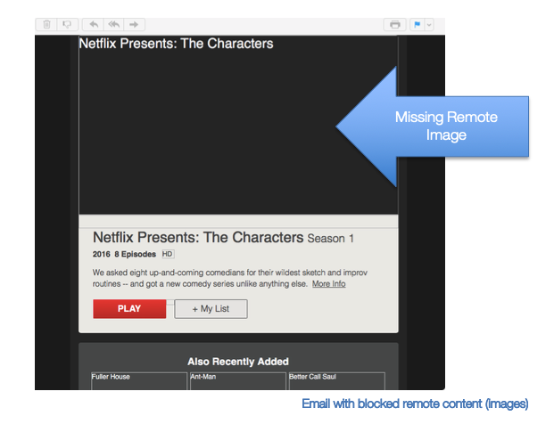
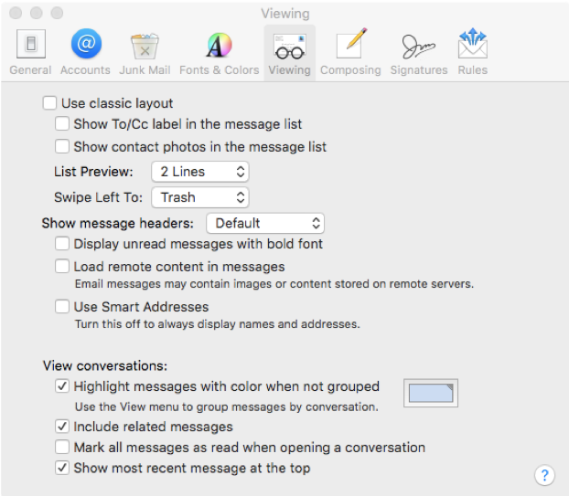
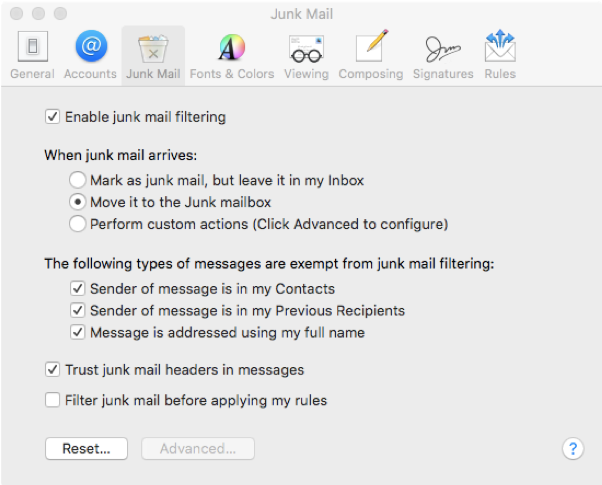
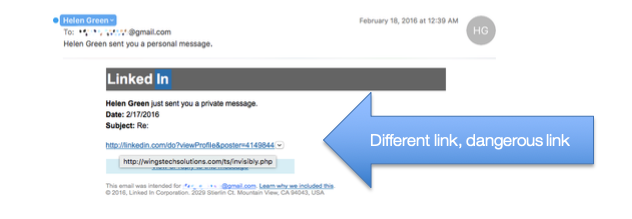

# Checking the Mail

This document is a reference and preparation sheet for the trainer, and a companion to the lesson plan.

The Learning Objectives summarize the knowledge that learners should have gained by the time they reach the end of the module.

The Background and Detail for Trainer provides greater details on the content, and links to references. It will allow trainers to learn more about the topic so they can lead discussions or answer questions confidently without being limited to the classroom content. Each item in the Background supports a section in the Lesson Script.

### Learning Objectives

- An understanding of what email is

- An understanding of the risks of email

- An understanding of spam and junk mail

- Knowledge of how to make decisions about email

## Background and Detail for Trainer

### 1 What email is

#### 1.1 In Brief

Email is a method of sending correspondence (messages) over the Internet. Every email is sent
to an email address.

#### 1.2 In Detail

- Email services are provided by Internet service providers, places of work and online services,
many of which are free.

- You can send email with a program or app on your computer, with a mobile device or with
a web service, such as Gmail, Hotmail, Yahoo! mail and many more.

	- A program or app connects to an email service, collects the email you have been sent,
    and sends email you have written.

	- A web service email is a website that you can visit to send and receive your email.

- Emails are sent to and from an email address.

	- In an email address, the name and information given are not guaranteed to be true—there is no verification.

 		- It is very easy to make a fake or misleading email address.

 		- There is no limit on the number of email addresses one person can have.

			- Many people have multiple email addresses (e.g., one for work, one for home, one for use when junk services ask for an address).

			- Most email apps allow multiple email addresses.

				- Use this to your advantage. If you don’t want to give away personal information but need to give an email address, use one from a free provider that does not contain personal information.

- Email addresses have three parts:

	- The part before the ‘@’ symbol is a name chosen for the individual email account. It can
    be anything that has not already been chosen by someone at that provider (two people
    can’t have the same address).

	- The ‘@’ symbol is used as a divider in the address. All email addresses require this symbol.

	- The portion after the ‘@’ symbol is the domain name or the name of the server that the
    email should be sent to for final sorting. This is the organization providing the email service.

	- A name associated with an email address can be shown with or instead of the address on an email. This can be set to anything at all, and so doesn’t necessarily show the sender’s real name.

- Email messages all contain the following pieces of information:

	- A Sender, receiver, copied receiver, blind copied receiver, subject and the body of the email.

 		- The **_To_** field is where you type the email address of the person you are sending
the message to.

		- The **_From_** field contains your email address and is usually automatically entered.

		- The **_CC_** (Carbon Copy) field is used when you want to send a copy of the message to another email address at the same time.

		- The **_BCC_** (Blind Carbon Copy) field is used when you want to quietly send a copy of the message to another email address without telling the other recipients (no-one but you will see that these people received a copy).

		- The **_Subject Line_** should describe the email's contents.

		- The **_Message Body_** is where you type your message.

	- The body of the email can contain many of the same aspects as a web page.

		- The program you use to read the email will interpret code in the email, format the message and include text, images, colours, fonts, links and other elements to show you the email as intended by the sender. Because of this, an email can present the same dangers as a webpage.

- Emails can also contain attachments or files that can be downloaded and used by the receiver. There is no guarantee that these files are what they say they are (e.g., a file named “cookie_recipe.exe” probably doesn’t have a recipe. It may be a virus).

#### 1.3 In Practice

DO regard all elements of an email as a work of fiction.

### 2 Email risks

#### 2.1 In Brief

Emails are not to be trusted; they can bring malware, and fraud.

Many scams start with an email. Treat email with suspicion and avoid clicking links in email.

#### 2.2 In Detail

- There is no security system inherent in email.

	- There is no way to confirm the sender of an email or its contents.

	- All of the elements in an email can be faked or manipulated.

	- Emails that you send are not secured and can be read or altered in transit.

- Email is well suited to automation.

	- It is possible to send thousands of emails every second.

	- All that the sender needs is the email address of the receiver.

	- There are many lists of emails harvested from the Internet that exist for this purpose,
    it is also possible to guess email addresses.

	- This feature of the Internet allows people to send huge numbers of email with very
    little effort.

	- Even if there is only a one in a million chance that that an email will reach someone who responds to it, it can be worth the effort when you can send 100 million emails a day.

- Receiving an email is no reason to believe that it was intentionally sent to you.

- Because emails can contain attachments, links and elements from web pages, it is possible
for email to transfer malware to people or to guide people to malicious web pages.

- **_Malware_**

- Malicious software, commonly known as malware can be delivered through email in a number of ways.

 	- Attachments.

		- Any file could be malware.

		- Even files that look benign and open normally can contain dangerous code that runs without you knowing[Note 1](#note-1).

		- These kinds of malware are called Trojans because they operate with
    the same strategy as the legendary Trojan horse.

		- All attachments should be viewed with suspicion and be scanned with
    a virus scanner.

	- Linked pages

		- Visiting a page from a link in an email can deliver malware to your computer.

		- View all links in emails with suspicion.

	- Content in the email

		- An email can contain content that is downloaded from the Internet when you open the email.

		- It is more secure to turn off this feature.

		- When you do turn it off, you will not see everything in a lot of emails. This doesn’t mean that anything is broken.

			- Image : 

			- Email with blocked remote content

		- Turning off remote content on **_Apple_** devices:

			- Go to the menu bar at the top of the screen, click Mail, then select Preferences.

			- On the preferences box select the Viewing options.
Uncheck the option to Load remote content in messages.

				- Image : 

		- **_Gmail_**

			- Open Gmail.

			- Click the gear icon in the top right.

			- Select **_Settings_**.

			- Stay in the **_General_** tab.

			- Scroll down to the **_Images_** section.

			- Choose Ask before displaying external images.

			- Click **_Save Changes_** at the bottom of the page.

			- **_Outlook_** is configured by default to Block remote pictures[Note 2](#note-2).

- **_Phishing_**

- Your personal information can be very valuable to criminals.

	- In particular, account log-in information (usernames and passwords) and financial information (credit card details) can provide great rewards.

	- Because of this, criminals put great effort into tricking people into giving away their valuable information. These efforts are referred to as phishing; as in fishing for personal information.

- Phishing emails often appear to be from an organization with which you would have stored some valuable information.

	- These emails often contain a link to a page where you can log in or enter valuable information on the pretext of checking or updating something.

	- Treat links in email to pages asking for personal information or a log-in with
extreme suspicion.

		- Avoid clicking on any link in an email from a bank or well known organization;
    such as Microsoft, Apple, eBay or Paypal.

		- If you receive an email and would like to check whether there is an issue with your account, go to the website in the usual way (type in the URL) or call the organization.

		- Do not click on the email link and do not copy the included URL into your browser.

- **_Scams_**

- Many scams are conducted over email.

- Remember that email can be sent to anybody from anybody and in an automated fashion.

	- Advance Fee Fraud

		- This kind of fraud will ask for a small payment in return for a great reward.
    This fraud takes many forms, for example:

			- The fraudster says they have access to a substantial amount of money, and explains where this money is supposed to have come from. They say they want to move the money out of the country, and then give you a reason why they can’t transfer it themselves. If you respond to the fraudsters’ request, they will ask you to pay various fees, such as legal fees, transaction fees or taxes, that are supposed to release the money. There are always more fees, and the money never comes or is bad cheque or counterfeit.

			- Bogus publishers, invention promotion and patent companies, model and casting agencies, all promising to launch a person’s career. The scams begin with some form of initial consultation but then require an upfront fee. The fraudsters often say that this fee will be used to undertake further work or research.

			- Seniors are solicited by phone or email and advised they have won a
large lottery or sweepstakes. Before receiving any winnings, the victim
must pay an upfront fee. No winnings are ever received.

	- Scammers constantly come up with new twists to prey on potential victims. There have been people who have received a call from someone claiming to represent Reader’s Digest or Set For Life Lottery. They are advised that in order to receive their winnings, they must provide their bank debit card number, date of birth and, in some cases, they are asked to enter their PIN into the telephone key pad. Scammers target seniors who do not use online banking services and then use the information to take over their account, and launder money and proceeds from other mass-marketing scams through it.

	- Warning Signs – How to Protect Yourself

		- Known lottery and sweepstakes companies such as Reader’s Digest and Publisher’s Clearinghouse never request money up front in order to send a prize.

		- Any fees associated with winnings will never be paid through a money service business such as Western Union, MoneyGram or by loading funds to prepaid credit cards such as Green Dot.

		- Any unsolicited phone call advising that you have won a lottery is fake.

			- The only way to participate in a foreign lottery is to go to that country and buy a ticket in person. A ticket cannot be bought on your behalf.

		- Never give out personal information over the phone, no matter who
the caller claims to represent.

- Not all scams are about getting rich or a great deal, etc. Other types of scams play
    on your emotions.

	- The Emergency Scam

		- Scammers use social media, the Internet and newspapers to target potential victims. They call, claiming to be a family member or close friend, advising about an urgent situation that requires immediate funds. Common themes have been that the family member was arrested or had an accident while travelling abroad. Fees are required for hospital expenses, lawyers or bail. Usually, the potential victim is instructed to send money through a money service business like Western Union or MoneyGram.

		- Warning Signs – How to Protect Yourself

			- Confirm the whereabouts of the family member or friend with other relatives/friends.

			- Police, judges or legal entities will never ask you to send money through money service business.

			- Never give out family members’ names or information to
unknown callers.

			- Always question urgent requests for money.

- If you think you or someone you know has been a victim of fraud, contact the Canadian Anti-Fraud Centre at 1-888-495-8501 or report online at [Canadian Anti-Fraud Centre](http://www.antifraudcentre.ca). Also, do not hesitate to seek advice from a friend, family member or someone you trust.

#### 2.3 In Practice

DO think before you click, and click rarely if ever.

DO treat emails with suspicion. They are not to be trusted.

DO take the time to think, overcome scammers trying to pressure you into sharing information.

### 3 Spam and junk email

#### 3.1 In Brief

Spam is junk email that might end up in your email inbox. A lot of this email is filtered by your
email provider and application. You can adjust the sensitivity of the filter. You can report spam
to [FightSpam](http://fightspam.gc.ca.)

#### 3.2 In Detail

- Spam is generally thought of as annoying advertising emails that occasionally appear in our inbox.

	- Legally, spam is not only the sending of unsolicited commercial electronic messages, but also the unauthorized alteration of transmission data, the installation of computer programs without consent, false or misleading electronic representations (including websites), the unauthorized collection of electronic addresses and the collection of personal information by accessing a computer system in contravention of an Act of Parliament[Note 3](#note-3).

	- If you feel that a company is breaking the law by sending you unsolicited email, read more and report them at [FightSpam](http://fightspam.gc.ca.)

- ISPs, email service providers and software providers work very hard to limit spam.^
They do a lot of automatic filtering so that only a small fraction of spam messages
ever reach their destination.

- Email apps can flag email they think are junk but are not quite sure. They normally place
these in a separate “junk” or “spam” folder.

	- You can look through the messages in this folder to double-check that no mistakes happened. Rarely, a message will be marked as “junk/spam” when it is legitimate.

		- In those cases, there is usually a button you can press to tell the app that this
one is safe (not junk). The system will learn to let similar messages come through
in future.

	- Some email applications let you control how aggressive the spam filter is.

		- Setting it to Low means that junk mail may end up in your inbox more frequently but there is less risk of accidentally diverting legitimate email.

		- Setting it at Maximum means that it will catch most junk mail but may mistakenly
divert legitimate messages as if they were junk, so you will need to retrieve them
from the junk/spam folder manually.

		- Find the level that is comfortable for you.

		- Setting Junk Mail Filters

			- Apple Mail

				- In Apple’s mail application, go to the menu bar at the top of the screen and click **_Mail_** then select **_Preferences_**.

				- In the **_Preferences_** box, select the **_Junk Mail_** options. Make sure that
Enable junk mail filtering is checked.

					- Image : 

			- Microsoft Outlook

				- Office 365[Note 4](#note-4)

					- To get to the **_Junk Email_** page from the main Outlook Web App page, go to the upper corner and choose **_Options_** , then choose **_Junk Email_** from the list in the navigation pane.

					- Make sure the “Don't filter junk email” option is not selected[Note 5](#note-5).

			- Gmail

				- In the Gmail webmail page, the Spam or Junk mail filter is on by default, and will work with you to classify mail.

				- If you are waiting for an email that seems to be lost, check the “Spam” mailbox in the options on the left.

				- If you find a message wrongly classified as spam, unmark the message by selecting it, and click the “Not Spam” button at the top and bottom of your current view.

				- Unmarking a message will automatically move it to your inbox[Note 6](#note-6).

#### 3.3 In Practice

DO be aware that junk email is being filtered out of your inbox.

DO adjust and assist the filter where you can.

### 4 Making decisions about email

#### 4.1 In Brief

If email is expected, and as expected, it is probably okay. If an email is unexpected, and strange it is probably not okay. There is never a reason you have to click and you can take your time to think before you decide to do anything.

#### 4.2 In Detail

- Identifying genuine email:

	- This email appears to be for me if:

		- the sender is known;

		- it is personalized (contains content that is in character with the sender);

		- the grammar used is good or is in character with the sender’s use of language..

	- Be suspicious of:

		- Unexpected emails;

		- Emails from banks or companies with which you do not have a relationship;

		- Any email that requests account information or threatens dire consequences for not immediately providing or updating personal information, such as closing an account;

		- Emails that claim to be from businesses but contain misspelled words or sloppy grammar;

		- Business messages sent from a domain name other than the one usually used
by that business[Note 7](#note-7);

		- Emails that require urgent or immediate action;

		- Emails asking to send money to Western Union, MoneyGram or prepaid credit cards.

- Warning Signs – How to Protect Yourself

	- Don’t panic. You have time to think. There is no rush.

		- Think before you click ... on attachments and links.

		- Manually check the URLs behind email hyperlinks by hovering the mouse over them (This is dangerous and is not to be recommended).

			- Image : 

		- As a rule there is no reason you should ever have to click on a link in an email. If it seems important you can visit the sender’s website by typing the URL yourself or just call them.

	- If you get a worrying email:

		- Don’t click on the email. Instead:

			- Go to the source, type your usual address into your browser and check your account.

			- Call your service provider and confirm the email.

- Remember:

	- If it looks too good to be true... it is.

	- Don’t give out personal or credit card information based just on an email.

	- Don’t feel pressured.

		- You always have plenty of time.

		- You can always walk away, hang up and check (call back the main number, talk to friends, family and authorities) before proceeding.

		- Sharing your concerns is a good way to feel reassured and help others be aware of fraud.

	- If it is fraud... recognize it... report it... stop it!

		- Contact the Canadian Anti-Fraud Centre at 1-888-495-8501 or report online
at [Canadian Anti-Fraud Centre](http://www.antifraudcentre.ca)

#### 4.3 In Practice

DO relax, think clearly, and take your time with email.

## Glossary of Terms

|Terms|Definitions|
|:------------:|:------------------------|
Canadian Anti-Fraud / Centre (CAFC)| The central agency in Canada that receives online Internet fraud complaints.
Cyberbullying | Willful and repeated harm inflicted through computers, cell phones, and other electronic devices.
E-transfer | A method of sending or receiving money online by Interac.
Money Service Business | A company that allows you to send money to another person somewhere in the world
Paypal | A company that allows for transfer of funds to other people online.
Pin Personal | Identification Number.
Pop-Up Ad | An advertisement that opens in a new browser window, often popping up into view.
Scam | A dishonest or deceptive scheme usually for criminal purposes.
Scammer | A person who scams.
Smartphone | A phone that operates much like a computer and is able to browse the Internet and install applications.
Webcam | A video camera that is able to transmit video signal over the Internet.
YouTube | A website (youtube.com) that provides access to video content.

##### Note 1
 [Spear phishing email attack](http://www.trendmicro.com/cloud-content/us/pdfs/security-intelligence/white-papers/wp-spear-phishing-email-most-favored-apt-attack-bait.pdf)

##### Note 2
 [Block or unblock automatic picture downloads in email messages](https://support.office.com/en-us/article/Block-or-unblock-automatic-picture-downloads-in-email-messages-15e08854-6808-49b1-9a0a-50b81f2d617a)

##### Note 3
 [Canada's Anti-Spam Legislation](http://fightspam.gc.ca/eic/site/030.nsf/eng/00303.html#ic-subnav-2)

##### Note 4
 [Overview of the Junk Email Filter](https://support.office.com/en-us/article/overview-of-the-junk-email-filter-5ae3ea8e-cf41-4fa0-b02a-3b96e21de089?omkt=en-CA&ui=en-US&rs=en-CA&ad=CA)

<!--
Footnote 4 = Original link not working.

ORIGINAL = Pour Office 2010 : <https://support.office.com/fr-fr/article/%C3%80-propos-du-filtre-Courrier-ind%C3%A9sirable-5ae3ea8e-cf41-4fa0-b02a-3b96e21de089?ui=fr-FR&rs=fr-FR&ad=FR>
-->

##### Note 5
 [Junk Email](https://support.office.com/en-US/article/Options-Junk-Email-068FA430-F8D7-4518-A8DA-8BC74958F05F)

<!-- footnote 6 = error 404 = original link =  https://support.google.com/mail/answer/9008?hl=en -->

##### Note 6
 [Gmail Help](https://support.google.com/mail#topic=7065107)

##### Note 7
  Note that sometimes businesses do outsource email services to third parties who use their own domain names but it is better to be safe than sorry.
